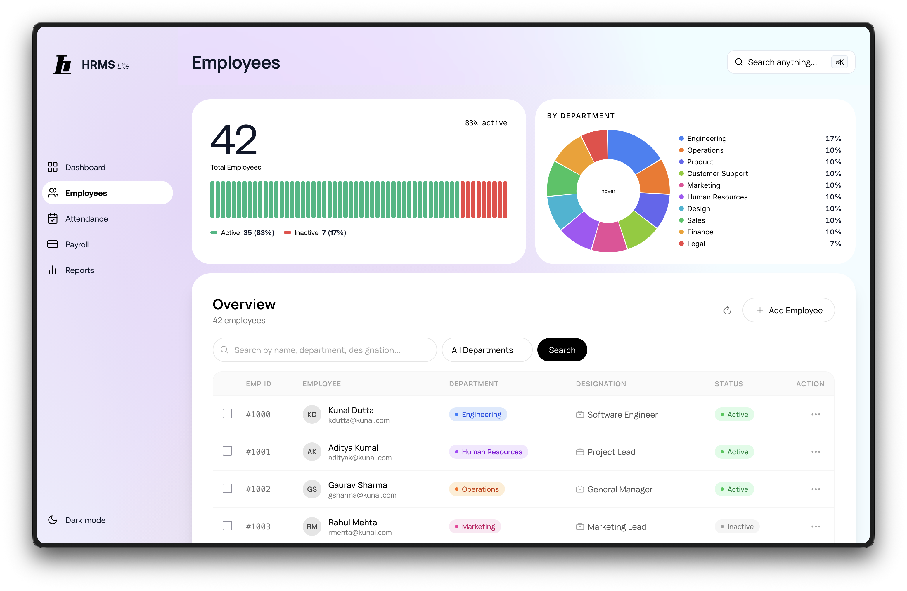
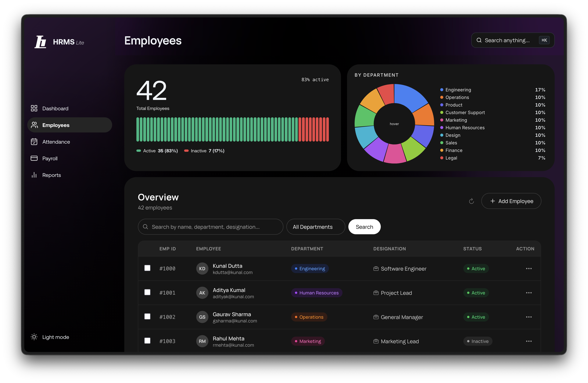
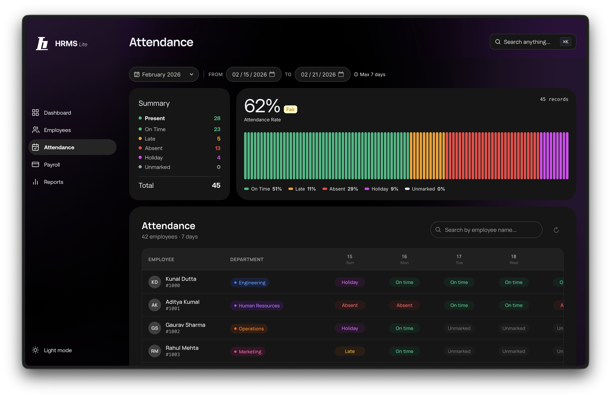
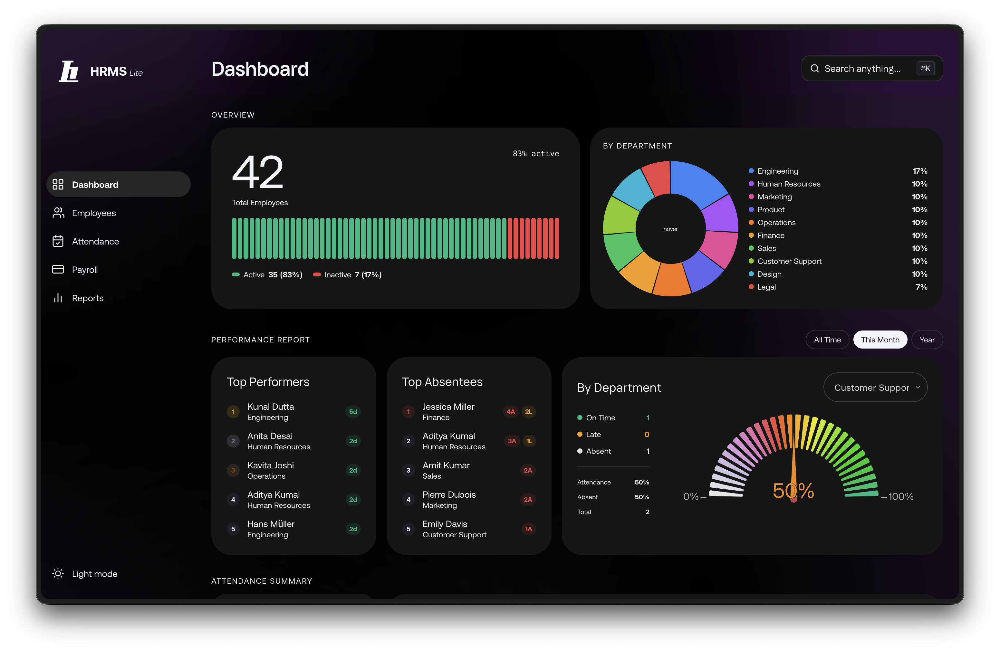
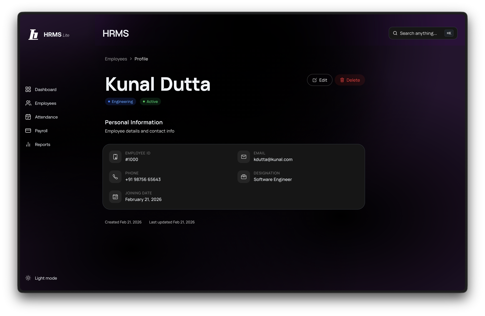
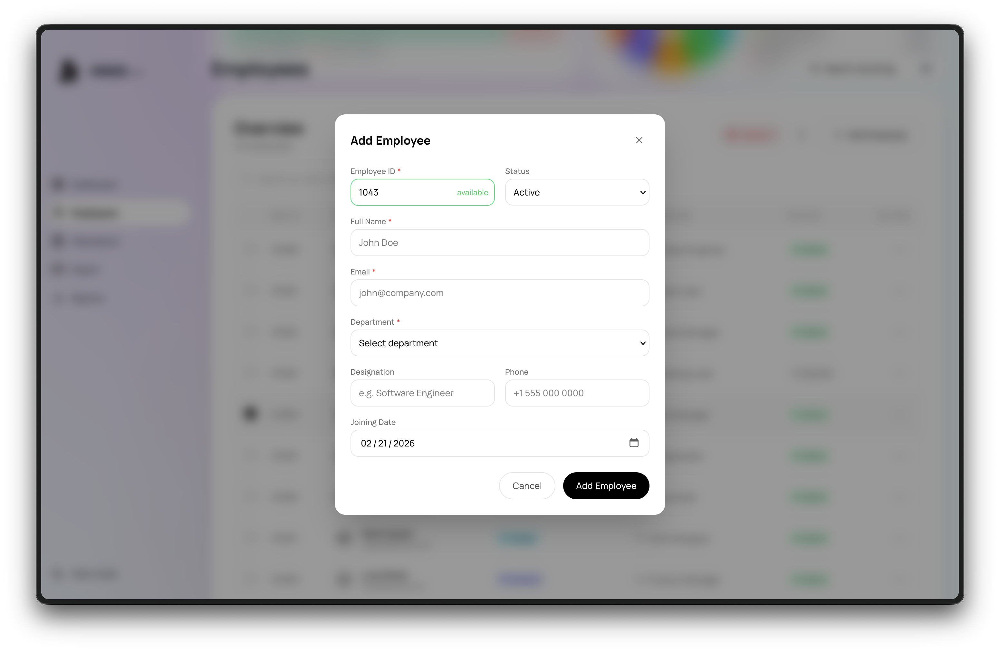
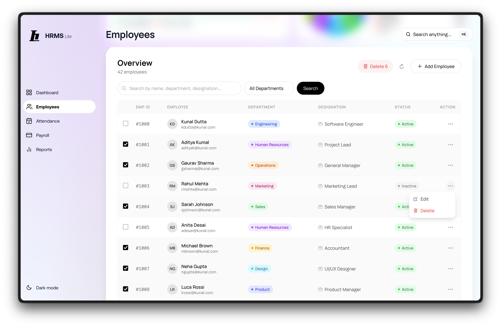

# HRMS Lite

A clean, modern **Human Resource Management System** built with Next.js, MongoDB, and Tailwind CSS. It covers the core workflows any HR team needs. Managing employees, tracking attendance, and viewing analytics, all through a snappy single-page experience with dark/light mode support.

> Built as a full-stack project to explore MongoDB aggregation pipelines, modular API design, and the Next.js App Router.



---

## What It Does

### Employee Directory (Home)

The landing page is a searchable, paginated employee list. You can add employees individually or in bulk, edit their details inline, and remove them with a confirmation step. A status card and department pie chart sit alongside the table for a quick snapshot.



### Dashboard

A view that pulls together employee stats and attendance analytics. You can filter by date range, all time, this month, or a specific year, and see top performers, frequent absentees, and per-department attendance gauges all in one place.




### Employee Profile

Click on any employee to see their full profile — ID, email, phone, department, designation, and joining date. Edit or delete right from here. The page uses the View Transitions API for a smooth animated navigation.




### Attendance

A day-by-day attendance grid where you pick a date range (up to 7 days) and mark each employee as on-time, late, absent, or on holiday by clicking through the cells. Summary cards at the top show attendance rates and counts for the selected window.



## More Screenshots



### Payroll & Reports

These sections are planned but currently show an "Under Construction" placeholder.

---

## How It's Built

### MongoDB Aggregation Pipelines

Instead of pulling raw data and crunching numbers on the server, the heavy lifting happens inside MongoDB itself using `$facet`, `$group`, `$lookup`, and `$match` stages:

- **Employee stats** — a single `$facet` query returns total, active, and inactive counts plus a department breakdown in one round trip.
- **Paginated lists** — `$facet` handles both the data slice (`$skip`/`$limit`) and the total count in a single pipeline, avoiding a separate count query.
- **Attendance analytics** — the most involved pipeline joins attendance records with employees via `$lookup`, then fans out into five `$facet` buckets: overall summary, department-level rates, daily trends, top absentees, and top performers.

This keeps things fast and moves the computation close to the data.

### REST API

All data flows through a clean set of Next.js Route Handlers under `/api`. Every response follows a consistent `{ success, data, message, pagination }` shape.

| Method | Endpoint | Purpose |
|--------|----------|---------|
| GET | `/api/employees` | Paginated list with search, status & department filters |
| POST | `/api/employees` | Create a new employee |
| GET | `/api/employees/:id` | Fetch a single employee |
| PUT | `/api/employees/:id` | Update an employee |
| DELETE | `/api/employees/:id` | Remove an employee |
| POST | `/api/employees/bulk` | Bulk import employees |
| DELETE | `/api/employees/bulk-delete` | Bulk remove employees |
| GET | `/api/employees/check-id` | Live duplicate-ID validation |
| GET | `/api/employees/stats` | Aggregated employee statistics |
| GET | `/api/attendance` | Employees + attendance for a date range |
| PUT | `/api/attendance` | Upsert a single attendance record |
| GET | `/api/attendance/analytics` | Full attendance analytics |

### Modular Architecture

The codebase is split into clear layers:

```
app/api/         → Route Handlers (request/response logic)
services/        → API client functions with typed responses
models/          → Mongoose schemas and indexes
components/      → Reusable UI, grouped by feature
config/          → Database connection
lib/             → Shared utilities and constants
```

Each API route focuses on request validation and response formatting, while Mongoose models define the data shape and indexes (like the compound `{ employee, date }` unique index on attendance). The `services/` layer gives the frontend clean, typed functions to call without worrying about fetch boilerplate.

---

## Tech Stack

| | |
|---|---|
| **Framework** | Next.js (App Router) |
| **Language** | TypeScript |
| **Database** | MongoDB Atlas + Mongoose |
| **Styling** | Tailwind CSS with CSS custom properties for theming |
| **Charts** | react-minimal-pie-chart, react-gauge-component |
| **UX** | Cmd+K command palette, skeleton loading, View Transitions API |

## Getting Started

1. **Install dependencies**

   ```bash
   npm install
   ```

2. **Set up environment variables**

   Create `.env.local` in the project root:

   ```env
   MONGODB_URI=mongodb+srv://<user>:<password>@<cluster>.mongodb.net/<dbname>?retryWrites=true&w=majority
   ```

3. **Run the dev server**

   ```bash
   npm run dev
   ```

   Open [http://localhost:3000](http://localhost:3000).

---

## Live Demo & Links

| | |
|---|---|
| **Live Application** | `https://hrms.kunaldutta.com` |
| **GitHub Repository** | `https://github.com/kunalduttagit/hrms` |

---

## Assumptions & Limitations

- **Single admin user** — no authentication or role-based access; the app assumes one trusted admin.
- **Payroll & Reports** — intentionally out of scope per the assignment; placeholder pages are included for navigation completeness.
- **Attendance date range** — capped at 7 days per view to keep the grid readable and limit payload size.
- **Employee ID** — numeric, user-assigned (not auto-incremented) to allow custom ID schemes.
- **Time zones** — attendance dates are normalized to UTC midnight; no per-user timezone handling.
- **No auth** — all endpoints are public; suitable for internal/demo use only.

---

Built with caffeine and curiosity.
